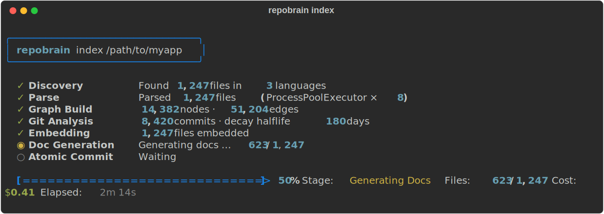
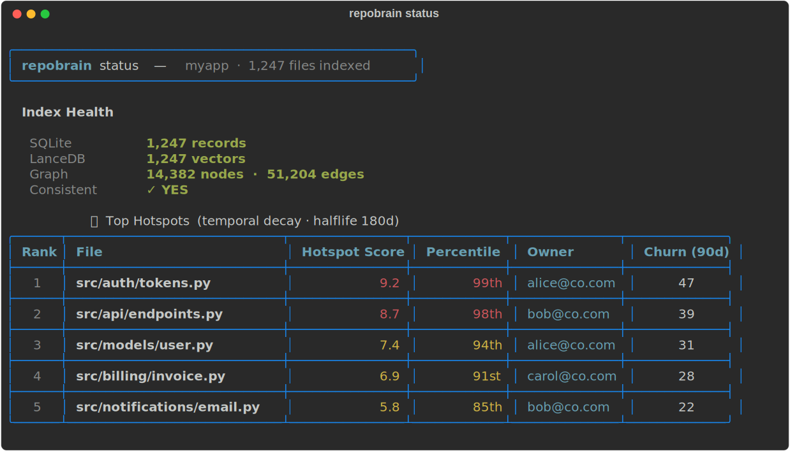
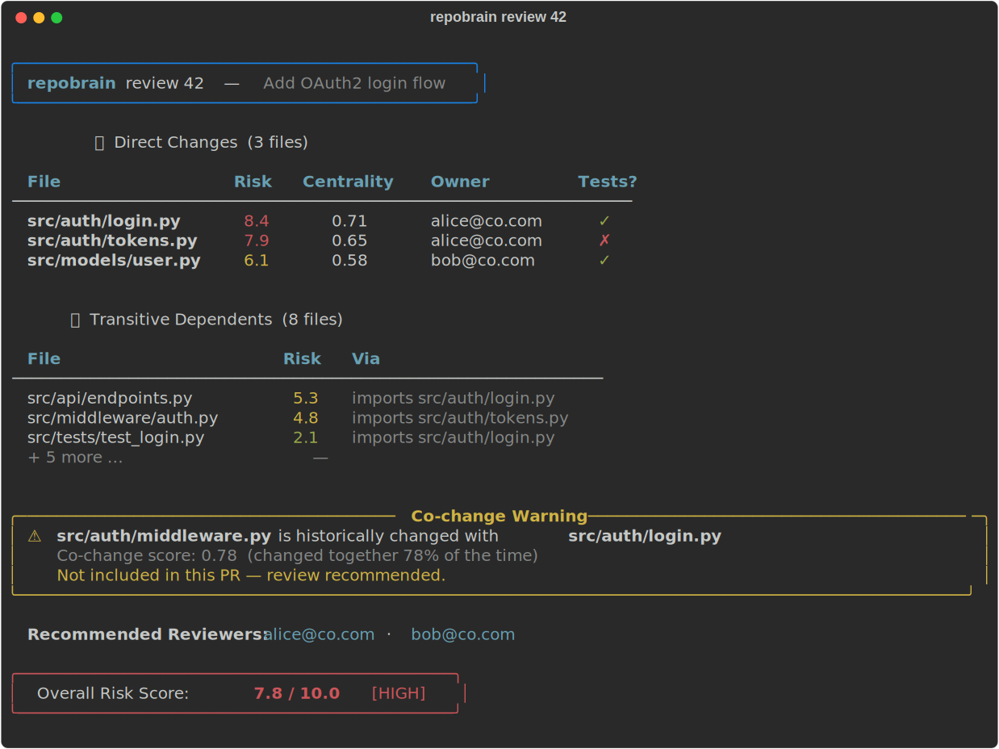
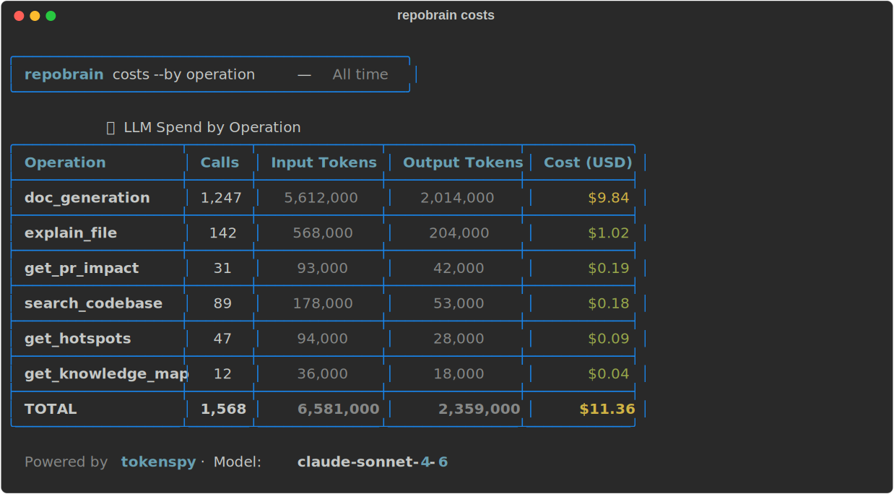
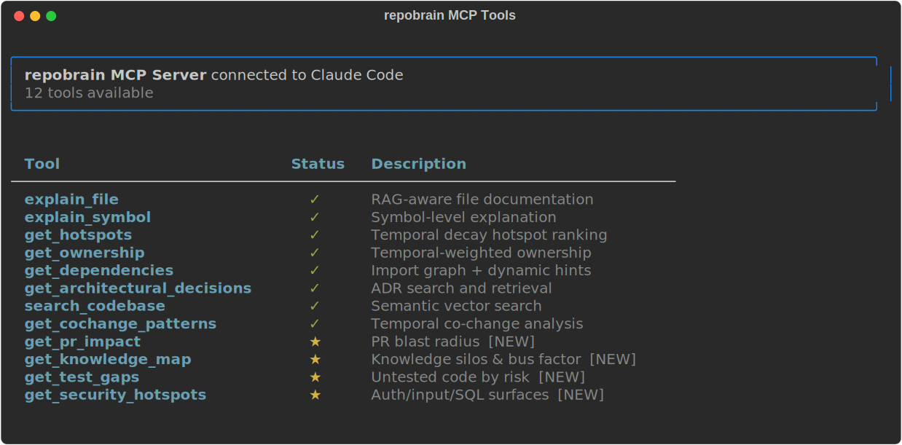

<div class="hero-banner" markdown="1">


# repobrain

**Codebase intelligence that thinks ahead.**

[](https://pypi.org/project/repobrain/)
[](https://www.python.org/downloads/)
[](https://github.com/pinexai/repobrain/blob/main/LICENSE)
[](https://modelcontextprotocol.io)

<a href="getting-started/quickstart/" class="btn-primary">Get Started</a>
&nbsp;&nbsp;
<a href="https://github.com/pinexai/repobrain" class="btn-outline">View on GitHub</a>
&nbsp;&nbsp;
<a href="comparison/" class="btn-outline">vs. repowise</a>
</div>

---

repobrain is a **self-hosted MCP server** for Claude that gives it deep, always-fresh understanding of your codebase — 10× faster indexing, RAG-aware documentation, PR blast radius, temporal hotspot scoring, and 12 MCP tools.

---

## Live Demo

<div id="demo-player" class="ap-wrapper"></div>

<script>
  document.addEventListener("DOMContentLoaded", function(){
    AsciinemaPlayer.create("assets/demo.cast", document.getElementById("demo-player"), {
      cols: 120, rows: 35, autoPlay: true, loop: true, speed: 1.5,
      theme: "monokai", fit: "width",
      terminalFontFamily: "'JetBrains Mono', 'Fira Code', monospace"
    });
  });
</script>

---

## Six Core Capabilities

<div class="feature-grid" markdown="1">

<div class="feature-card" markdown="1">
**🔗 Graph Intelligence**

tree-sitter parses Python, TypeScript, JavaScript, and Go into a NetworkX dependency graph. PageRank centrality identifies architectural hubs. Dynamic hint extractors (Django, pytest, Node) recover **20–40% of edges** that static analysis misses.
</div>

<div class="feature-card" markdown="1">
**⏱ Temporal Scoring**

Exponential decay weights recent commits exponentially higher. A fix merged yesterday counts far more than code from 2 years ago. Half-life is configurable. Percentile ranks refresh on every incremental update.
</div>

<div class="feature-card" markdown="1">
**📚 RAG Documentation**

`RAGAwareDocGenerator` fetches dependency docs from LanceDB **before** every LLM call. This is the #1 architectural flaw in repowise — it populates the vector store but never queries it during generation.
</div>

<div class="feature-card" markdown="1">
**💥 PR Blast Radius**

`PRBlastRadiusAnalyzer` traces direct + transitive impact of every PR. Risk score 0–10. Co-change warnings for historically coupled files. Reviewer recommendations based on ownership.
</div>

<div class="feature-card" markdown="1">
**🔒 Atomic Transactions**

`AtomicStorageCoordinator` wraps every write across SQLite, LanceDB, and NetworkX in a single logical transaction. Any failure rolls back all three stores. No silent consistency failures (5–15% failure rate in repowise).
</div>

<div class="feature-card" markdown="1">
**💰 Cost Tracking**

`TokenspyCostAdapter` wraps every Anthropic call and records per-operation token spend. `repobrain costs` shows a breakdown by command, date, and model. Know exactly what your indexing costs.
</div>

</div>

---

## Screenshots

### `repobrain index` — 7-stage async pipeline



### `repobrain status` — Temporal hotspot rankings



### `repobrain review 42` — PR blast radius analysis



### `repobrain costs` — LLM spend by operation



### MCP Tools — 12 tools available in Claude Code



---

## Why repobrain?

After reverse-engineering repowise's architecture, we found **10 critical flaws**. repobrain fixes every one:

| # | Repowise Flaw | repobrain Fix |
|---|---|---|
| 1 | RAG context never used during generation | Dependency docs fetched from LanceDB *before* every LLM call |
| 2 | 25+ min initial indexing | 7-stage async pipeline with `ProcessPoolExecutor` + concurrent git/parse |
| 3 | No atomic transactions across 3 stores | `AtomicStorageCoordinator` rolls back SQL + LanceDB + NetworkX atomically |
| 4 | Hardcoded 500-commit limit | Configurable `GitConfig.max_commits = 10_000` |
| 5 | Dynamic imports invisible (20–40% missing edges) | Django, pytest, Node hint extractors |
| 6 | Incremental updates miss percentile recalculation | `upsert()` always triggers `PERCENT_RANK()` window refresh |
| 7 | No PR blast radius analysis | `PRBlastRadiusAnalyzer` + `get_pr_impact` MCP tool |
| 8 | Temporal blindness (old commits = recent commits) | Exponential decay scoring |
| 9 | Zero cost visibility | `TokenspyCostAdapter` + `repobrain costs` CLI |
| 10 | Conservative dead code detection | Dynamic hint edge recovery |

[See the full comparison →](comparison.md)

---

## Get Started

```bash
pip install repobrain
repobrain index /path/to/your/repo
repobrain serve  # start MCP server for Claude Code
```

Returning repowise users: [migrate in 5 minutes →](reference/migration.md)

New users: [Quick Start guide →](getting-started/quickstart.md)
